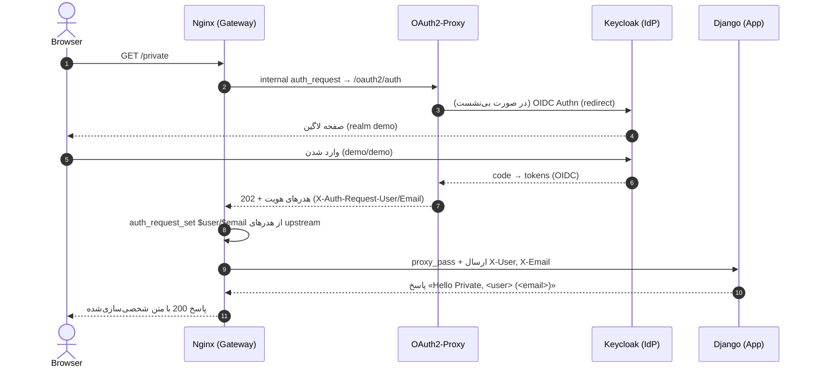

<div dir='rtl'>

# فاز ۳ — «هویتِ لبه تا اپ» (Edge-to-App Identity)


## 1) هدف

### ۱.الف) تعریف عمومی (برای مخاطب غیرتخصصی)

در این فاز کاری می‌کنیم که وقتی کاربر وارد (Login) شد، **اسم و ایمیلش** به برنامه‌ی ما برسد تا برنامه بتواند پاسخ‌هایی مثل «سلام فلانی!» نشان بدهد. **امنیتِ ورود** همچنان بیرون از برنامه (در دروازه‌ی ورود) انجام می‌شود؛ برنامه فقط **اسم/ایمیل** را دریافت و نمایش می‌دهد.

### ۱.ب) تعریف تخصصی (برای توسعه‌دهنده)

الگوی **Nginx `auth_request` → OAuth2-Proxy (OIDC) → Keycloak**، پس از موفقیت در احراز هویت، هدرهای استانداردی مثل `X-Auth-Request-User` و `X-Auth-Request-Email` را به Nginx برمی‌گرداند. در Nginx این هدرها با `auth_request_set` به متغیر تبدیل و سپس با `proxy_set_header` به صورت **`X-User`** و **`X-Email`** به Django پاس می‌شوند. View مربوط به `/private` در Django، هدرها را از `request.META` می‌خواند و پاسخ شخصی‌سازی‌شده تولید می‌کند.

### ۱.ج) تحلیل عمیق با تمرکز بر **System Design**

* **Separation of Concerns (Edge vs App):**
  احراز هویت و مدیریت نشست/توکن در «لبه» (Gateway/Proxy) انجام می‌شود؛ برنامه تنها **claimهای حداقلی** (user/email) را مصرف می‌کند. این جداسازی باعث **کاهش پیچیدگی اپ**، **بالارفتن امنیت** (عدم نیاز به نگه‌داری توکن/رازها در اپ)، و **مقیاس‌پذیری** می‌شود.
* **لمینت‌شدن مسئولیت‌ها:**
  Keycloak (IdP) مدیریت هویت، OAuth2-Proxy تبدیل جریان OIDC به هدرهای امن و جلسه‌ی وب، Nginx اعمال سیاست دسترسی و عبور هدرها، Django ارائه‌ی محتوا.
* **حداقل سطح اعتماد به درون اپ:**
  اپ صرفاً به هدرهایی که **تنها از مسیر حفاظت‌شده** می‌آیند اعتماد می‌کند. مسیرهای آزاد هدرهای هویت دریافت نمی‌کنند.

### ۱.د) تحلیل عمیق با تمرکز بر **منطق کسب‌وکار**

* **شخصی‌سازی تجربه کاربر** (نمایش نام/ایمیل) بدون درگیرشدن اپلیکیشن با پروتکل‌های پیچیده‌ی OIDC.
* **آماده‌سازی برای قواعد دسترسی** (Role/Grou‌p-Based) در فازهای بعدی با افزودن یک یا دو هدر دیگر (مثل `X-Groups`) **بدون تغییر بنیادین در اپ**.
* **کاهش هزینه نگه‌داری**: تیم محصول می‌تواند بر سناریوهای کسب‌وکار (صفحات، جریان‌ها) تمرکز کند؛ تیم امنیت/زیرساخت مسئول احراز هویت باقی می‌ماند.

### ۱.ه) شکستن هدف کلی به زیرهدف‌ها

1. عبور هدرهای هویت از OAuth2-Proxy به Nginx و از Nginx به Django.
2. نمایش کاربر در `/private` با «Hello Private, \<user> (\<email>)».
3. حفظ رفتار `/public` به صورت بدون لاگین.
4. نگه داشتن لایه احراز هویت در مرز (نه داخل اپ).

### ۱.۲) جایگاه و اهمیت در پروژه

این فاز **پل بین امنیت لبه و منطق اپ** است. فاز ۲ احراز هویت را در Edge برقرار کرد؛ فاز ۳ خروجی آن احراز هویت را **به شکلی استاندارد و کم‌هزینه** به اپلیکیشن می‌رساند. اینجا پایه‌ی **شخصی‌سازی** و **اجازه‌محورشدن** پاسخ‌ها گذاشته می‌شود.

### دیاگرام معماری (ویژه‌ی فاز ۳)

```mermaid
flowchart LR
    U[Browser] -->|GET /private| N[Nginx (auth_request)]
    N -->|/oauth2/auth| P[OAuth2-Proxy]
    P <--> K[Keycloak (OIDC)]
    P -->|202 + X-Auth-Request-User/Email| N
    N -->|X-User/X-Email| D[Django App]
    D -->|Hello Private, user (email)| U
```

---

## 2) عناصر فاز

### ۲.الف) لیست فایل‌ها/کلاس‌ها/توابع (ساختار درختی)

```
auth-stack/
├── nginx/
│   └── nginx.conf                   # عبور هدرها از Edge به App
└── app/
    ├── core/
    │   ├── views.py                 # public_view / private_view
    │   ├── urls.py                  # مسیرها
    │   └── identity.py (اختیاری)    # Value Object: Identity
    └── manage.py / settings.py ...  # بدون تغییر ساختاری
```

### ۲.ب) تشریح هر بخش

#### nginx/nginx.conf

* **هدف فایل:** دروازه‌ی ورودی، اجرای auth\_request و سپس عبور claims به اپ.
* **بخش‌های مهم:**

  * `location = /oauth2/auth` (internal) برای چک هویت.
  * `auth_request_set $user/$email` استخراج هدرهای oauth2-proxy.
  * `proxy_set_header X-User/X-Email` عبور به اپ.
* **وظیفه در این فاز:** تضمین انتقال امن و مینیمال هویت به Django.

#### app/core/views.py

* **کلاس/توابع:**

  * `public_view(request)` → پاسخ «Hello Public».
  * `private_view(request)` → خواندن `HTTP_X_USER` و `HTTP_X_EMAIL` از `request.META` و تولید پاسخ شخصی‌سازی‌شده.
* **وظیفه در این فاز:** نمایش هویتِ عبورکرده از Edge.

#### app/core/urls.py

* **هدف فایل:** نگاشت URLها به viewها (`/public`, `/private`).
* **وظیفه در این فاز:** مسیر `/private` به view جدید/به‌روز متصل باشد.

#### app/core/identity.py (اختیاری – برای Clean Architecture)

* **DataClass پیشنهادی:**

  ```python
  from dataclasses import dataclass

  @dataclass(frozen=True)
  class Identity:
      user: str
      email: str | None = None
  ```
* **تابع کمکی پیشنهادی:**

  ```python
  def identity_from_headers(meta: dict) -> Identity:
      user  = meta.get("HTTP_X_USER") or meta.get("HTTP_X_AUTH_REQUEST_USER") or "Unknown"
      email = meta.get("HTTP_X_EMAIL") or meta.get("HTTP_X_AUTH_REQUEST_EMAIL")
      return Identity(user=user, email=email)
  ```
* **وظیفه در این فاز:** جداسازی parsing هدرها از منطق view برای تست‌پذیری و خوانایی.

---

## 3) ارتباط و تعامل

### درون همین فاز/لایه

* **`nginx.conf` ↔ `oauth2-proxy`**: `nginx` از `/oauth2/auth` نتیجه هویت را می‌گیرد.
* **`nginx.conf` → `views.py`**: `nginx` هدرهای `X-User/X-Email` را به اپ پاس می‌کند؛ `views.py` آن‌ها را مصرف می‌کند.
* **`views.py` ↔ `identity.py` (اختیاری)**: View با فراخوانی `identity_from_headers`، Value Object می‌سازد.

### ارتباط با فازها/لایه‌های دیگر

* **با فاز ۲ (SSO Edge):** این فاز مصرف‌کننده‌ی خروجی فاز ۲ است (claims).
* **با فاز ۴ (TLS/سخت‌سازی):** فعال‌شدن TLS → `OAUTH2_PROXY_COOKIE_SECURE=true` و سیاست‌های HSTS؛ رفتار مرورگر پایدارتر می‌شود.
* **با فازهای بعد (Authorization/RBAC):** افزودن `X-Groups` یا `X-Roles` در Edge و استفاده‌ی اپ فقط برای نمایش/فیلترهای ساده (قواعد اصلی دسترسی همچنان در Edge توصیه می‌شود).

---

### یادداشت‌های طراحی (Clean Architecture + DDD + SOLID)

* **SRP/SOLID:** view تنها **نمایش** را انجام می‌دهد؛ parsing هدرها (در صورت استفاده) به ماژول کمکی منتقل می‌شود.
* **Dependency Rule (Clean Architecture):** اپ به لایه‌ی بیرونی وابسته نمی‌شود؛ فقط **قرارداد هدرها** را می‌شناسد.
* **DDD:** `Identity` یک **Value Object** ساده است؛ اگر دامنه‌ی هویت بزرگ‌تر شد (claims بیشتر)، این مدل قابل‌گسترش است.
* **Security by Design:** حداقل داده (Least Privilege) عبور می‌کند؛ هیچ توکن/راز OIDC داخل اپ نگه‌داری نمی‌شود.

---

## پیوست (تأیید نهایی اعمال فاز ۳)

### چک‌لیست پذیرش

* [ ] در `nginx.conf` برای `/private`:
  `auth_request` + `auth_request_set $user/$email` + `proxy_set_header X-User/X-Email` وجود دارد.
* [ ] در `views.py`، `private_view` هدرها را از `request.META` خوانده و نمایش می‌دهد.
* [ ] `/public` بدون نشست → **200**.
* [ ] `/private` بدون نشست → **302** به Keycloak؛ پس از login (`demo/demo`) → **200** با:
  `Hello Private, demo (demo@example.com)` یا مشابه.
* [ ] لاگ‌های Nginx/Django **بدون خطای auth/header** هستند.

# اجرای فاز ۳

# فاز ۳ — عبور هدر هویت به Django و نمایش کاربر

## دیاگرام توالی (Mermaid)



---

## تغییرات موردنیاز

### 1) Nginx: تنظیم عبور هدرها

فایل: `auth-stack/nginx/nginx.conf`
(اگر قبلاً طبق فاز ۲ این ساختار را اعمال کرده‌ای، فقط بلوک‌های زیر را **تأیید/تصحیح** کن.)

```nginx
http {
    resolver 127.0.0.11 valid=10s ipv6=off;

    server {
        listen 80;
        server_name _;

        # --- OAuth2-Proxy plumbing ---
        location /oauth2/ {
            proxy_pass       http://oauth2-proxy:4180;
            proxy_set_header Host               $host;
            proxy_set_header X-Real-IP          $remote_addr;
            proxy_set_header X-Forwarded-For    $proxy_add_x_forwarded_for;
            proxy_set_header X-Forwarded-Proto  $scheme;
        }

        location = /oauth2/auth {
            internal;
            proxy_pass       http://oauth2-proxy:4180/oauth2/auth;
            proxy_set_header X-Original-URL     $scheme://$http_host$request_uri;
            proxy_set_header X-Real-IP          $remote_addr;
            proxy_set_header X-Scheme           $scheme;
            proxy_pass_request_body off;
            proxy_set_header Content-Length "";
        }

        # --- مسیر آزاد ---
        location /public {
            proxy_pass       http://web:8000;
            proxy_set_header Host               $host;
            proxy_set_header X-Real-IP          $remote_addr;
            proxy_set_header X-Forwarded-For    $proxy_add_x_forwarded_for;
            proxy_set_header X-Forwarded-Proto  $scheme;
        }

        # --- مسیر محافظت‌شده: استخراج و عبور هدرهای هویت ---
        location /private {
            # 1) تایید هویت
            auth_request /oauth2/auth;
            error_page 401 = /oauth2/start?rd=$request_uri;

            # 2) دریافت هدرهای هویت از پاسخ upstreamِ auth_request
            auth_request_set $user  $upstream_http_x_auth_request_user;
            auth_request_set $email $upstream_http_x_auth_request_email;

            # 3) عبور هویت به اپ (Django)
            proxy_set_header X-User  $user;
            proxy_set_header X-Email $email;

            # 4) فوروارد به اپ
            proxy_pass       http://web:8000;
            proxy_set_header Host               $host;
            proxy_set_header X-Real-IP          $remote_addr;
            proxy_set_header X-Forwarded-For    $proxy_add_x_forwarded_for;
            proxy_set_header X-Forwarded-Proto  $scheme;
        }

        # سایر مسیرها → اپ
        location / {
            proxy_pass       http://web:8000;
            proxy_set_header Host               $host;
            proxy_set_header X-Real-IP          $remote_addr;
            proxy_set_header X-Forwarded-For    $proxy_add_x_forwarded_for;
            proxy_set_header X-Forwarded-Proto  $scheme;
        }
    }
}
```

> نکته امنیتی: هدرهای دریافتی از auth\_request فقط در سمت Nginx به متغیر تبدیل می‌شوند و سپس به‌صورت **X-User/X-Email** به اپ ارسال می‌شوند؛ کل منطق احراز هویت در مرز (Edge) می‌ماند.

---

### 2) Django: خواندن هدرها در view مربوط به `/private`

**فایل‌ها** (در مسیر `auth-stack/app/`):

* `core/views.py` (یا جایی که viewهای فاز ۱ را گذاشتی)
* `core/urls.py` (تضمین اتصال مسیر)
* (اختیاری) `templates/private.html` اگر خروجی HTML بخواهی

#### 2.1 کد نمونه `views.py`

```python
# auth-stack/app/core/views.py
from django.http import HttpResponse
from django.views.decorators.http import require_GET

@require_GET
def public_view(request):
    return HttpResponse("Hello Public", content_type="text/plain; charset=utf-8")

@require_GET
def private_view(request):
    # هدرها در WSGI با پیشوند HTTP_ در دسترس‌اند
    user  = request.META.get("HTTP_X_USER") or request.META.get("HTTP_X_AUTH_REQUEST_USER") or "Unknown"
    email = request.META.get("HTTP_X_EMAIL") or request.META.get("HTTP_X_AUTH_REQUEST_EMAIL") or ""
    # نمایش مینیمال (Plain Text)
    if email:
        msg = f"Hello Private, {user} ({email})"
    else:
        msg = f"Hello Private, {user}"
    return HttpResponse(msg, content_type="text/plain; charset=utf-8")
```

> توجه: ما به هدرهای ورودی اعتماد «کنترلی» نداریم (اپ نباید تصمیم‌های امنیتی را بر اساس آن‌ها بگیرد)؛ این‌ها صرفاً برای personalization در لایهٔ نمایش استفاده می‌شوند. کنترل دسترسی در Edge انجام شده است.

#### 2.2 مسیرها `urls.py`

```python
# auth-stack/app/core/urls.py
from django.urls import path
from .views import public_view, private_view

urlpatterns = [
    path("public", public_view, name="public"),
    path("private", private_view, name="private"),
]
```

> اگر در فاز ۱ این مسیرها را ساخته‌ای، فقط جایگزین `private_view` کن.

---

## دستورهای اجرای تغییرات

> مسیر جدیدی لازم نیست؛ فقط سرویس‌ها را ری‌استارت کن تا کانفیگ و کد جدید اعمال شود.

```bash
# در ریشه پروژه
cd auth-stack

# اعمال تغییرات Nginx و Django
docker compose restart nginx
docker compose restart web

# بررسی لاگ‌ها
docker compose logs -f nginx
docker compose logs -f web
```

---

## تست (High-Level)

1. **مسیر آزاد**

   ```bash
   curl -i http://app.127.0.0.1.nip.io:8080/public
   # 200 Hello Public
   ```

2. **ورود و تست مسیر خصوصی (مرورگر)**

   * برو به: `http://app.127.0.0.1.nip.io:8080/private`
   * به Keycloak (realm `demo`) هدایت می‌شوی → با `demo/demo` وارد شو
   * باید متن زیر (یا مشابه) ببینی:

     ```
     Hello Private, demo (demo@example.com)
     ```

3. **بررسی عبور هدرها در Nginx**

   * لاگ Nginx هنگام فراخوانی `/private` نباید خطای `401` پس از login بدهد.
   * اگر می‌خواهی مطمئن شوی هدرها پاس می‌شوند، موقتاً این لاگ را در بلاک `/private` اضافه و تست کن (dev-only):

     ```nginx
     add_header X-Debug-User  $user  always;
     add_header X-Debug-Email $email always;
     ```

     سپس با `curl -i` ببین در پاسخ برمی‌گردد (بعد از تست حذف کن).

---

## چک‌لیست پذیرش فاز ۳

* [ ] در `nginx.conf` برای `/private` وجود دارد:
  `auth_request`, `auth_request_set $user/$email`, `proxy_set_header X-User/X-Email`
* [ ] در Django، `private_view` هدرهای `X-User` و `X-Email` را می‌خواند و نمایش می‌دهد
* [ ] `/public` بدون نشست → **200**
* [ ] `/private` بدون نشست → **302** به Keycloak؛ پس از login → **200** با متن «Hello Private, <user> (<email>)»
* [ ] لاگ‌ها بدون خطاهای auth یا header

---

## اصول طراحی (Clean Architecture + DDD + SOLID + Pythonic)

* **Separation of Concerns (SRP/SOLID):**
  احراز هویت و سیاست دسترسی در مرز (Nginx + OAuth2-Proxy)؛ اپ تنها View/Presentation را انجام می‌دهد.
* **Dependency Direction:**
  اپ به IdP وابسته نیست؛ فقط به هدرهای استاندارد اعتماد حداقلی دارد.
* **Minimal Surface:**
  تنها هدرهای لازم (`X-User`, `X-Email`) پاس می‌شوند؛ از عبور claimهای غیرضروری خودداری می‌کنیم.
* **Testability:**
  `private_view` ساده و قابل Mock است (با تزریق هدر در `request.META` در تست Django).
* **Extensibility (DDD-friendly):**
  اگر در آینده نقش/دسته‌بندی کاربر لازم شد، فقط نقشهٔ هدرها را گسترش می‌دهیم (مثلاً `X-Groups`).

---
