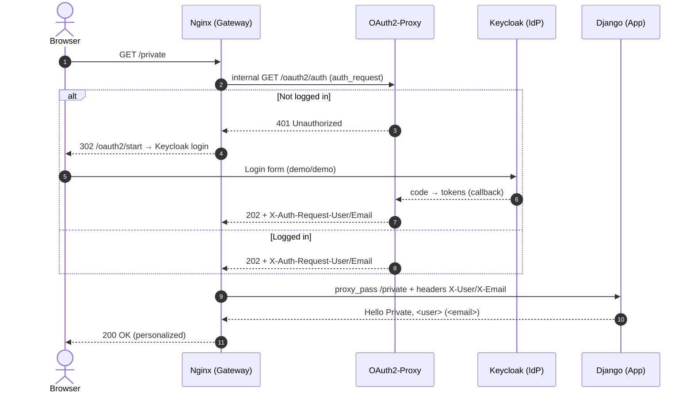

<style>
.rtl-align {
  direction: rtl;
  text-align: right;
}

/* لیست‌ها هم راست‌چین */
.rtl-align ul,
.rtl-align ol {
  list-style-position: inside;
  padding-right: 0;
  margin-right: 1em;
}

/* فقط باکس‌های کد (مثل ```...```) چپ‌چین و مونو */
.rtl-align pre code {
  direction: ltr;           /* جهت چپ به راست */
  text-align: left;         /* تراز چپ */
  display: block;           /* حالت باکس */
  background: #f5f5f5;      /* پس‌زمینه روشن مثل حالت کد */
  padding: 10px;            /* فاصله داخلی */
  border-radius: 5px;       /* گوشه‌های گرد */
  font-family: monospace;   /* فونت مونو برای کد */
  white-space: pre;         /* حفظ فاصله‌ها */
}
</style>

<div class="rtl-align">


#### توضحی ساده از ارتباط عناصر این پروژه 

 بیاییم با زبان ساده ولی دقیق ببینیم **Django، Nginx، OAuth2-Proxy و Keycloak** چطور با هم حرف می‌زنن؛ کجاها این ارتباط پیکربندی شده؛ و اگر بخوای شاخه‌برگ بدی، کجاها باید دست ببری.

---

# 1) تعامل این چهار جزء، قدم‌به‌قدم (ساده و شفاف)

فرض کن کاربر آدرس **`/private`** رو در مرورگر می‌زنه:

1. **مرورگر → Nginx**
   درخواست به Nginx می‌رسه (درگاه ورودی).

   * Nginx طبق پیکربندی، می‌گه: «برای `/private` باید اول از **OAuth2-Proxy** بپرسم این کاربر لاگین هست یا نه.»

2. **Nginx → OAuth2-Proxy (auth\_request)**
   Nginx یک درخواست داخلی به مسیر **`/oauth2/auth`** می‌فرسته (روی خود Nginx، ولی پشت‌صحنه به سرویس oauth2-proxy پاس میشه).

   * اگر کاربر **لاگین** باشه: oauth2-proxy جواب **`202 Accepted`** می‌ده و هدرهای هویت رو برمی‌گردونه (مثل نام کاربر و ایمیل).
   * اگر **لاگین نیست**: oauth2-proxy جواب **`401 Unauthorized`** می‌ده.

3. **(فقط وقتی لاگین نیست)** OAuth2-Proxy ←→ Keycloak
   Nginx با دیدن 401، کاربر رو به مسیر **`/oauth2/start`** می‌فرسته، و oauth2-proxy هم کاربر رو به صفحه لاگین **Keycloak** (OIDC) هدایت می‌کنه.

   * کاربر داخل Keycloak با کاربر `demo/demo` وارد می‌شه.
   * Keycloak بعد از ورود، کاربر رو برمی‌گردونه به oauth2-proxy (Callback)؛ oauth2-proxy توکن‌ها رو می‌گیره و براش **کوکی نشست** می‌سازه.

4. **OAuth2-Proxy → Nginx**
   بعد از لاگین، از این به بعد هر auth\_request، **202** می‌شه و oauth2-proxy هدرهایی مثل:
   `X-Auth-Request-User` و `X-Auth-Request-Email` رو به Nginx پس می‌ده.

5. **Nginx → Django**
   Nginx همون هدرها رو تبدیل می‌کنه به `X-User` و `X-Email` و به **Django** پاس می‌ده.

   * Django این هدرها رو از `request.META` می‌خونه و پاسخ «Hello Private, <user> (<email>)» می‌ده.

6. **Django → Nginx → مرورگر**
   متن نهایی به مرورگر برمی‌گرده. تمام! ✨

---

# 2) کدوم فایل‌ها این ارتباط رو می‌سازن؟ (و کجای فایل، دقیقاً)

| جزء              | فایل                              | خط/تنظیم مهم                                                  | نقش دقیق                                                                 |
| ---------------- | --------------------------------- | ------------------------------------------------------------- | ------------------------------------------------------------------------ |
| **Nginx**        | `nginx/nginx.conf`                | `location = /oauth2/auth`                                     | پلِ auth\_request به oauth2-proxy؛ فقط 202/401 و هدرهای هویت را می‌گیرد. |
|                  |                                   | `location /private` + `auth_request /oauth2/auth`             | اجباری‌کردن ورود برای /private                                           |
|                  |                                   | `auth_request_set $user $upstream_http_x_auth_request_user`   | گرفتن نام کاربر از پاسخ oauth2-proxy                                     |
|                  |                                   | `auth_request_set $email $upstream_http_x_auth_request_email` | گرفتن ایمیل                                                              |
|                  |                                   | `proxy_set_header X-User $user` و `X-Email $email`            | پاس‌دادن هویت به اپ                                                      |
| **OAuth2-Proxy** | `oauth2-proxy/oauth2-proxy.cfg`   | `OAUTH2_PROXY_OIDC_ISSUER_URL`                                | آدرس issuer رِلم demo در Keycloak برای Discovery                         |
|                  |                                   | `OAUTH2_PROXY_CLIENT_ID/SECRET`                               | شناسه/راز کلاینت روی Keycloak                                            |
|                  |                                   | `OAUTH2_PROXY_REDIRECT_URL`                                   | آدرس Callback بیرونی (روی هاست Nginx)                                    |
|                  |                                   | `OAUTH2_PROXY_SET_XAUTHREQUEST=true`                          | فعال‌کردن هدرهای `X-Auth-Request-*` (کلیدِ کار)                          |
|                  |                                   | `OAUTH2_PROXY_COOKIE_SECRET`                                  | رمزدهی کوکی نشست                                                         |
| **Keycloak**     | `keycloak/realms/demo-realm.json` | `clients[].clientId=oauth2-proxy`                             | تعریف کلاینت OIDC برای oauth2-proxy                                      |
|                  |                                   | `clients[].secret`                                            | باید با CONFIG oauth2-proxy یکی باشه                                     |
|                  |                                   | `clients[].redirectUris`                                      | باید دقیقاً با `REDIRECT_URL` یکی باشه                                   |
| **Django**       | `app/core/views.py`               | `private_view`: `request.META["HTTP_X_USER"]`                 | خواندن نام کاربر از هدر                                                  |
|                  |                                   | `HTTP_X_EMAIL`                                                | خواندن ایمیل (در صورت موجود بودن)                                        |
|                  | `app/core/urls.py`                | مسیر `/private`                                               | اتصال مسیر به view شخصی‌سازی‌شده                                         |
| **Compose**      | `docker-compose.yml`              | `ports` و `extra_hosts`                                       | پابلیش پورت‌ها و دسترسی دامنه‌های nip.io به لوپ‌بک                       |

> اگر بخوای فقط با یک نگاه بفهمی کجاها حیاتی‌اند:
> **`nginx.conf` (بلاک‌های `/private` و `/oauth2/auth`)**، **`oauth2-proxy.cfg` (issuer/client/redirect/set\_xauthrequest/cookie\_secret)**، **`demo-realm.json` (client/redirectUris/secret)**، و **`views.py`**.

---

# 3) دیاگرام تعامل (Mermaid)



---

# 4) مثال‌های واقعی از همین پروژه (کد/کانفیگ‌های کلیدی)

### Nginx (خلاصه بخش‌های مهم)

```nginx
location = /oauth2/auth {
    internal;
    proxy_pass       http://oauth2-proxy:4180/oauth2/auth;
    proxy_set_header X-Original-URL $scheme://$http_host$request_uri;
    proxy_pass_request_body off;
    proxy_set_header Content-Length "";
}

location /private {
    auth_request /oauth2/auth;
    error_page 401 = /oauth2/start?rd=$request_uri;

    auth_request_set $user  $upstream_http_x_auth_request_user;
    auth_request_set $email $upstream_http_x_auth_request_email;

    proxy_set_header X-User  $user;
    proxy_set_header X-Email $email;

    proxy_pass http://web:8000;
}
```

### OAuth2-Proxy (گزیده)

```dotenv
OAUTH2_PROXY_PROVIDER=keycloak-oidc
OAUTH2_PROXY_OIDC_ISSUER_URL=http://auth.127.0.0.1.nip.io:8081/realms/demo
OAUTH2_PROXY_CLIENT_ID=oauth2-proxy
OAUTH2_PROXY_CLIENT_SECRET=...        # = secret کلاینت در realm
OAUTH2_PROXY_REDIRECT_URL=http://app.127.0.0.1.nip.io:8080/oauth2/callback
OAUTH2_PROXY_SET_XAUTHREQUEST=true    # ← هدرهای X-Auth-Request-* را فعال می‌کند
OAUTH2_PROXY_COOKIE_SECRET=...        # 32 بایت واقعی (base64 urlsafe)
```

### Django (گزیده)

```python
# core/views.py
from django.http import HttpResponse
from django.views.decorators.http import require_GET

@require_GET
def private_view(request):
    user  = request.META.get("HTTP_X_USER") or "Unknown"
    email = request.META.get("HTTP_X_EMAIL")
    msg = f"Hello Private, {user}" + (f" ({email})" if email else "")
    return HttpResponse(msg, content_type="text/plain; charset=utf-8")
```

---

# 5) اگر بخوام پروژه رو «شاخه‌برگ» بدم، چه گزینه‌هایی دارم؟

ایده‌ها + فایل‌هایی که باید تغییر بدی:

## A) نمایش جزئیات بیشتر پروفایل

* **هدف:** نمایش `preferred_username`, `name`, یا claims اضافی.
* **کار لازم:**

  1. در Keycloak (realm `demo`) اگر claim جدیدی می‌خوای (مثلاً `preferred_username` خودش هست، برای `groups` باید mapper اضافه کنی).
  2. oauth2-proxy با `OAUTH2_PROXY_SET_XAUTHREQUEST=true` معمولاً هدرهایی مثل `X-Auth-Request-Preferred-Username` هم می‌فرسته.
  3. در Nginx اضافه کن:

     ```nginx
     auth_request_set $puser $upstream_http_x_auth_request_preferred_username;
     proxy_set_header X-Preferred-Username $puser;
     ```
  4. در Django از `HTTP_X_PREFERRED_USERNAME` بخون.

## B) RBAC ساده در Edge (بر اساس گروه/نقش)

* **هدف:** فقط اعضای یک گروه خاص به `/private` دسترسی داشته باشن.
* **کار لازم:**

  1. در Keycloak برای کلاینت `oauth2-proxy` یک **Client Scope Mapper** اضافه کن که `groups` را در توکن قرار بده.
  2. oauth2-proxy هدر `X-Auth-Request-Groups` را برمی‌گردونه (نیاز به set\_xauthrequest داریم که هست).
  3. Nginx بررسی کنه: اگر هدر گروه شامل گروه هدف نیست، 403 بده:

     ```nginx
     auth_request_set $groups $upstream_http_x_auth_request_groups;
     if ($groups !~ "admins") { return 403; }
     ```
  4. (اختیاری) هدر را به اپ پاس نده تا نشت اطلاعات کم باشد.

## C) Logout و پایان‌دادن نشست

* **هدف:** لینک خروج در اپ.
* **کار لازم:**

  * Nginx لینک بده به `/oauth2/sign_out` (oauth2-proxy)، و از آنجا به Keycloak end-session ریدایرکت می‌شود.
  * در Django یک لینک «خروج» بساز: `<a href="/oauth2/sign_out">Logout</a>`.

## D) سخت‌سازی و TLS (فاز ۴)

* **هدف:** تجربه شبیه پروڈاکشن و امنیت بیشتر.
* **کار لازم:**

  1. Nginx را با گواهی محلی (`mkcert`) روی `https` بیاور.
  2. `OAUTH2_PROXY_COOKIE_SECURE=true`
  3. HSTS در Nginx و Redirect 80→443.

## E) صفحه وضعیت دیباگ هدرها

* **هدف:** عیب‌یابی سریع در تیم.
* **کار لازم (Django):** یک view ساده که همه‌ی هدرهای `HTTP_X_*` را dump کند تا ببینی چه چیزهایی از Edge رسید.

  ```python
  @require_GET
  def whoami(request):
      lines = [f"{k}: {v}" for k, v in request.META.items() if k.startswith("HTTP_X_")]
      return HttpResponse("\n".join(sorted(lines)), content_type="text/plain; charset=utf-8")
  ```

## F) حفاظت چند مسیر با سیاست‌های متفاوت

* **هدف:** `/admin` فقط گروه «admins»، `/reports` گروه «analysts».
* **کار لازم:**

  * در `nginx.conf` برای هر `location`، یک شرط بر اساس `$upstream_http_x_auth_request_groups` بگذار؛ یا از `map` برای نگاشت پیشرفته استفاده کن.
  * اپ بی‌خبر می‌مونه (خوبه!)—سیاست در Edge پیاده می‌شه.

---

# 6) جمع‌بندی کوتاه

* **کلیدِ تعامل**:
  `nginx.conf` (auth\_request + انتقال هدرها) ←→ `oauth2-proxy.cfg` (issuer/client/redirect/set\_xauthrequest) ←→ Keycloak realm (client/redirectUris/secret) ←→ Django (خواندن هدرها از `request.META`).
* **تصمیم‌های امنیتی** را تا حد ممکن در **لبه (Edge)** نگه دار؛ اپ فقط از داده‌های حداقلی برای نمایش/منطق سبک استفاده کند.
* برای توسعه‌ی بیشتر (RBAC/Groups/Logout/TLS/…)، **پیکربندی**ها مهم‌تر از کد اپ هستند—مزیت همین معماری!

