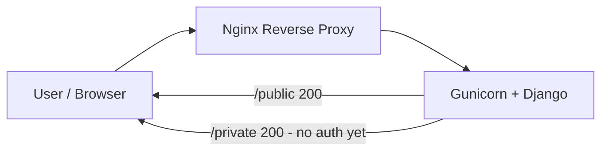

# فاز ۱ — «Gateway-App Bootstrap»

---

## 0) نام فاز

**Gateway-App Bootstrap**

(«بوت‌استرپ درگاه و اپلیکیشن»؛ هدف اصلی: راه‌اندازی مینیمال Nginx به‌عنوان درگاه و Django به‌عنوان اپ، آماده برای اتصال Auth در فاز بعد.)

---

## 1) هدف

### 1.1 تعریف عمومی (با مثال ساده)

در این فاز یک وب‌سایت خیلی ساده بالا می‌آید که دو صفحه دارد:

* `/public` که برای همه باز است و می‌گوید «Hello Public»
* `/private` که فعلاً باز است و می‌گوید «Hello Private»

همه‌ی درخواست‌ها اول به **Nginx** می‌رسند (مثل نگهبان درِ ورودی ساختمان) و بعد به **Django** (مثل دفتر داخل ساختمان) هدایت می‌شوند. هنوز کارتِ ورود (احراز هویت) لازم نیست؛ فقط سازوکار ورودی و پاسخ‌گویی داریم. این کار زیرساخت لازم برای اضافه‌کردن دربان هوشمند (OAuth/Keycloak) در فاز بعد را آماده می‌کند.

### 1.2 تعریف تخصصی (Developer-centric)

ما یک **Reverse Proxy** (Nginx) جلوی یک **WSGI App** (Django+Gunicorn) قرار می‌دهیم. دو endpoint پایه در لایه‌ی **Presentation** تعریف می‌کنیم تا مسیرهای عمومی/خصوصی آینده را از الان استاندارد کنیم. Compose، شبکه و service-naming از ابتدا ماژولار طراحی می‌شوند تا در فاز ۲ بتوانیم **OAuth2-Proxy** و **Keycloak** را بدون تغییر بنیادین اضافه کنیم. این فاز به‌نوعی «contract first» برای URIهای هسته است.

### 1.3 تحلیل سیستم‌دیزاین (چرایی/چیستی)

* **چرایی** :
* جداسازی **Gateway** از **App** باعث می‌شود concerns مثل caching, TLS termination, routing در لبه بماند و اپلیکیشن صرفاً منطق خود را اجرا کند.
* مینیمال کردن نقاط شکست (fail points) قبل از افزودن Auth، باعث ساده‌تر شدن دیباگ است.
* **چیستی** :
* یک top-level compose که شبکه‌ی مشترک ایجاد می‌کند؛
* سرویس Nginx که ترافیک بیرونی را می‌گیرد؛
* سرویس Django (Gunicorn) که تنها روی شبکه‌ی داخلی شنود می‌کند؛
* روت‌های `/public` و `/private` در اپ، فعلاً بدون policy.

### 1.4 تحلیل کسب‌وکار (چرایی/چیستی)

* **چرایی** :
* تحویل سریع یک PoC قابل‌نمایش برای استیک‌هولدرها (Time-to-Demo کوتاه).
* کاهش ریسک: قبل از سرمایه‌گذاری روی Auth و RBAC، مسیرهای اصلی و latency پایه را می‌سنجیم.
* **چیستی** :
* تعریف baseline کاربردی (دو مسیر پایه) که معیار پذیرش فاز بعد است.
* آماده‌سازی برای الزام‌های امنیتی/سازمانی (SSO, Audit) بدون قفل‌شدن در تصمیمات زودهنگام.

### 1.5 خرد کردن هدف به زیرهدف‌ها

1. ساخت اسکلت compose و شبکه‌ی داخلی.
2. راه‌اندازی Nginx به‌عنوان ورودی واحد.
3. راه‌اندازی Django با دو endpoint پایه (`/public`, `/private`).
4. تست سلامت مسیریابی (بدون Auth).
5. مستندسازی مسیرها و نقش‌ها برای فاز Auth.

### 1.6 جایگاه و اهمیت در پروژه

این فاز «ستون فقرات اجرا» است: اگر Gateway و App مینیمال و پایدار نباشند، افزودن OAuth2-Proxy/Keycloak دشوار و پرخطا می‌شود. این فاز تضمین می‌کند شبکه، نام‌گذاری سرویس‌ها، و قرارداد مسیرها استاندارد و پایدارند.

### 1.7 دیاگرام معماری فاز



---

## 2) عناصر فاز

### 2.1 لیست اجزا (کلاس/فایل/توابع) — طبقه‌بندی و درختی

```text
auth-stack/
├── docker-compose.yml                 # Orchestrator
├── nginx/
│   └── nginx.conf                     # Gateway config
└── app/
    ├── Dockerfile                     # Image build for Django
    ├── requirements.txt               # Django, gunicorn
    ├── manage.py                      # Django entry for admin tasks
    ├── config/
    │   ├── __init__.py
    │   ├── settings.py                # Django settings (DEBUG, ALLOWED_HOSTS, INSTALLED_APPS)
    │   ├── urls.py                    # Root URLConf -> include hello.urls
    │   └── wsgi.py                    # WSGI application for Gunicorn
    └── hello/
        ├── __init__.py
        ├── apps.py                    # HelloConfig (AppConfig)
        ├── urls.py                    # route: /public , /private
        └── views.py                   # def public_view , def private_view
```

> **Data Class خاصی در این فاز لازم نیست.** فقط Viewهای ساده‌ی تابعی.

### 2.2 تشریح عملکرد هر بخش

#### سطح Compose/Infra

* **`docker-compose.yml`**
  * **هدف** : تعریف سرویس‌ها (`nginx`, `web`)، شبکه مشترک، پورت اکسپوز، وابستگی‌ها.
  * **نقش در فاز** : اجرای یکپارچه و reproducible.
* **`nginx/nginx.conf`**
  * **هدف** : تعریف server{}، `proxy_pass` به `web:8000`، مسیرهای عمومی/خصوصی (فعلاً بدون auth).
  * **نقش در فاز** : ورود واحد ترافیک و آماده‌سازی برای `auth_request` در فاز بعد.

#### سطح App

* **`app/Dockerfile`**
  * **هدف** : build ایمیج سبک (python:slim)، نصب `requirements.txt`، تنظیم کاربر غیراز root.
  * **نقش در فاز** : جداسازی وابستگی‌ها و اجرای امن‌تر.
* **`app/requirements.txt`**
  * **هدف** : نسخه‌های پایدار `Django` و `gunicorn`.
  * **نقش در فاز** : build repeatable و مقیاس‌پذیر.
* **`app/manage.py`**
  * **هدف** : ابزار مدیریتی Django (migrate, runserver, createsuperuser).
  * **نقش در فاز** : در dev کمک می‌کند ولی در کانتینر، اجرا با gunicorn خواهد بود.
* **`app/config/settings.py`**
  * **هدف** : تنظیمات Django شامل `INSTALLED_APPS=['hello', ...]`, `ALLOWED_HOSTS`, `DEBUG`.
  * **نقش در فاز** : آماده‌سازی محیط برای روت‌های پایه و استقرار ساده.
* **`app/config/urls.py`**
  * **هدف** : `path('', include('hello.urls'))`؛ ورود مسیرها از اپ.
  * **نقش در فاز** : نگهداری روتینگ مرکزی.
* **`app/config/wsgi.py`**
  * **هدف** : اکسپوز کردن `application` برای Gunicorn.
  * **نقش در فاز** : درگاه اجرای WSGI.
* **`app/hello/apps.py` (کلاس: HelloConfig)**
  * **هدف** : پیکربندی اپ.
  * **نقش در فاز** : رجیستر تمیز اپ و استانداردسازی.
* **`app/hello/urls.py`**
  * **هدف** : تعریف دو route: `/public`, `/private`.
  * **نقش در فاز** : API contract پایه.
* **`app/hello/views.py`**
  * **توابع** :
  * `public_view(request) -> HttpResponse("Hello Public")`
  * `private_view(request) -> HttpResponse("Hello Private")`
  * **نقش در فاز** : پاسخ ساده، بدون وابستگی؛ آماده برای دریافت هدرها در فاز ۳.

---

## 3) ارتباط و تعامل

### 3.1 درون فاز (همین لایه)

* **`nginx.conf` ↔ `web` (Gunicorn/Django)** :

  Nginx تمام درخواست‌ها را به سرویس `web:8000` پروکسی می‌کند.
* **`config/urls.py` ↔ `hello/urls.py`** :

  فایل `urls.py` ریشه، روت‌های اپ `hello` را include می‌کند.
* **`hello/urls.py` ↔ `hello/views.py`** :

  هر مسیر به یک تابع View نگاشت می‌شود.

### 3.2 ارتباط با فازها/لایه‌های بعدی

* **به فاز ۲ (Auth layer)** :
* Nginx در همین فایل `nginx.conf` با افزودن `auth_request` به `/private` به **OAuth2-Proxy** متصل خواهد شد.
* Django تغییری بنیادی نمی‌کند؛ فقط `/private` از لبه محافظت می‌شود.
* **به فاز ۳ (Header propagation)** :
* Nginx هدرهای `X-User/X-Email` را بعد از تأیید Auth به Django پاس می‌دهد.
* `private_view` آماده است تا هدرها را خوانده و نمایش دهد (به‌روزرسانی کوچک).
* **به فاز ۴ (TLS/Redis/RBAC)** :
* Nginx همان Gateway برای termination TLS و سیاست‌های امنیتی خواهد بود.
* OAuth2-Proxy می‌تواند سشن‌ها را در Redis نگه‌دارد؛ Django بدون تغییر عمده.

---

### جمع‌بندی

**Gateway-App Bootstrap** تضمین می‌کند که ستون فقرات اجرای شما (Compose + Nginx + Django) ساده، پایدار و قابل‌گسترش است. این فاز با تعریف دو مسیر پایه و جداسازی لبه/اپلیکیشن، ریسک فنی را قبل از ورود Auth پایین می‌آورد و در عین حال یک دمو قابل‌ارائه به کسب‌وکار می‌دهد.

اگر تأیید می‌کنی، دستور بده تا همین حالا «محتوای مینیمال فایل‌ها» (compose/nginx/Django) را بنویسم و فاز ۱ را به‌صورت **قابل اجرا** تحویل بدهم.

# اجرای فاز

```mermaid
flowchart LR
  U[User / Browser] --> N[Nginx Reverse Proxy]
  N --> D[Django Hello World]
  D -->[|/public| U]
  D -->[|/private فعلاً بدون Auth| U]
```

## دستورات Bash (فقط ساخت مسیر/فایل؛ بدون اجرای کد)

> ریشه: `./auth-stack`  — همه مسیرها UTF-8

```bash
# 1) ریشه پروژه
mkdir -p auth-stack && cd auth-stack

# 2) پوشه‌های سرویس‌ها
mkdir -p nginx
mkdir -p app

# 3) فایل‌های سطح ریشه
touch docker-compose.yml

# 4) Nginx
touch nginx/nginx.conf

# 5) اسکلت Django (فایل‌ها را خالی بساز؛ محتوا در گام اجرا پر می‌شود)
#   ساختار حداقلی برای اجرای Hello World با Gunicorn
mkdir -p app/{config,hello}
touch app/Dockerfile
touch app/requirements.txt
touch app/manage.py

#   پکیج‌های پایتونی
touch app/config/__init__.py
touch app/config/settings.py
touch app/config/urls.py
touch app/config/wsgi.py

#   اپلیکیشن hello
touch app/hello/__init__.py
touch app/hello/apps.py
touch app/hello/views.py
touch app/hello/urls.py

# (اختیاری) فایل env
touch .env
```

## ساختار TREE این فاز

```text
auth-stack/
├── .env
├── docker-compose.yml
├── nginx/
│   └── nginx.conf
└── app/
    ├── Dockerfile
    ├── requirements.txt
    ├── manage.py
    ├── config/
    │   ├── __init__.py
    │   ├── settings.py
    │   ├── urls.py
    │   └── wsgi.py
    └── hello/
        ├── __init__.py
        ├── apps.py
        ├── urls.py
        └── views.py
```

## فایل‌ها و نقش‌شان (این فاز)

| مسیر                   | نقش                                                                                                                                     |
| -------------------------- | ------------------------------------------------------------------------------------------------------------------------------------------ |
| `docker-compose.yml`     | ارکستراسیون سرویس‌ها (nginx, web) و شبکه مشترک؛ ساده و شفاف برای توسعه.                    |
| `nginx/nginx.conf`       | Reverse proxy به Django (درگاه ورودی)، تعریف مسیرهای `/public` و `/private` (فعلاً هر دو آزاد). |
| `app/Dockerfile`         | ایمیج سبک Python برای اجرای Django با Gunicorn؛ جداسازی وابستگی‌ها از میزبان.                 |
| `app/requirements.txt`   | نسخه‌های موردنیاز (Django, gunicorn) برای Build قابل تکرار و قابل‌اعتماد.                         |
| `app/manage.py`          | نقطه ورود مدیریت Django (runserver، migrations، …).                                                                       |
| `app/config/settings.py` | تنظیمات پروژه (INSTALLED\_APPS، MIDDLEWARE، ALLOWED\_HOSTS، …).                                                            |
| `app/config/urls.py`     | روتینگ اصلی پروژه؛ اتصال `/public` و `/private` (از اپ `hello`).                                           |
| `app/config/wsgi.py`     | ورود WSGI برای Gunicorn در محیط container.                                                                                   |
| `app/hello/apps.py`      | رجیستر اپلیکیشن ساده `hello`.                                                                                          |
| `app/hello/views.py`     | دو View مینیمال که متن “Hello Public” و “Hello Private” برمی‌گردانند.                                       |
| `app/hello/urls.py`      | نگاشت مسیرهای `/public` و `/private` به ویوهای مربوطه.                                                      |
| `.env`                   | (اختیاری) پارامترهای ساده مانند `DJANGO_DEBUG`, `DJANGO_SECRET_KEY`؛ جداسازی کانفیگ از کد. |

## روش تست (High-Level)

* Compose را اجرا کنید؛ سپس:

  * `GET http://localhost:8080/public` → **200 OK** و متن “Hello Public”.
  * `GET http://localhost:8080/private` → **200 OK** و متن “Hello Private” (فعلاً بدون Auth).
* لاگ‌های Nginx و Django را بررسی کنید که روتینگ صحیح باشد و خطای 502/404 دیده نشود.

## الزامات اجرایی این فاز

* خروجی‌ها و مسیرها همگی UTF-8.
* **Separation of Concerns**: Nginx (Gateway) از Django (App) جدا باشد.
* نام‌گذاری سرویس‌ها/شبکه‌ها واضح و ماژولار (قابل توسعه در فازهای بعد).
* عدم قفل‌کردن روی میزبان: همه‌چیز از طریق Docker قابل اجرا و حذف باشد.
* فایل‌ها خالی ایجاد شده‌اند؛ محتوای مینیمال YAML/NGINX/Django در گام اجرا (یا فاز تأییدی بعدی) پر می‌شود.

## اصول و استانداردها (Clean Architecture + DDD + SOLID + Pythonic)

* **Single Responsibility**: هر کانتینر یک کار — Nginx برای ورودی، Django برای منطق اپ.
* **Low Coupling / High Cohesion**: وابستگی‌ها و پیکربندی‌ها به‌صورت ماژولار و مجزا.
* **Explicit Config**: مسیرها و فایل‌های کانفیگ مشخص و قابل ردیابی؛ استفاده از `.env` در صورت نیاز.
* **Readability & Simplicity**: حداقل فایل‌های لازم برای اجرای Hello World و آمادگی برای Auth در فاز بعد.

---

### چک‌لیست پذیرش فاز ۱

* [ ] ساختار پوشه/فایل دقیقاً مطابق TREE ایجاد شد.
* [ ] فایل‌های کلیدی (compose, nginx.conf, اسکلت Django) آماده‌ی پرشدن هستند.
* [ ] تفکیک Nginx/Django رعایت شده و مسیرهای `/public` و `/private` پیش‌بینی شده‌اند.
* [ ] آماده‌ی الحاق OAuth2-Proxy + Keycloak در فاز ۲ هستیم.
