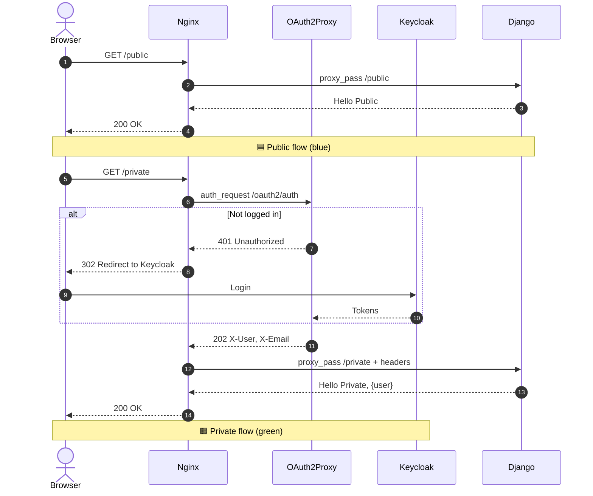

```mermaid
sequenceDiagram
    autonumber
    actor Browser
    participant Nginx
    participant OAuth2Proxy
    participant Keycloak
    participant Django

    %% مسیر عمومی (آبی)
    Browser->>Nginx: GET /public
    Nginx->>Django: proxy_pass /public
    Django-->>Nginx: Hello Public
    Nginx-->>Browser: 200 OK
    Note over Browser,Django: 🟦 Public flow (blue)

    %% مسیر خصوصی (سبز)
    Browser->>Nginx: GET /private
    Nginx->>OAuth2Proxy: auth_request /oauth2/auth
    alt Not logged in
        OAuth2Proxy-->>Nginx: 401 Unauthorized
        Nginx-->>Browser: 302 Redirect to Keycloak
        Browser->>Keycloak: Login
        Keycloak-->>OAuth2Proxy: Tokens
    end
    OAuth2Proxy-->>Nginx: 202 X-User, X-Email
    Nginx->>Django: proxy_pass /private + headers
    Django-->>Nginx: Hello Private, {user}
    Nginx-->>Browser: 200 OK
    Note over Browser,Keycloak: 🟩 Private flow (green)

```
