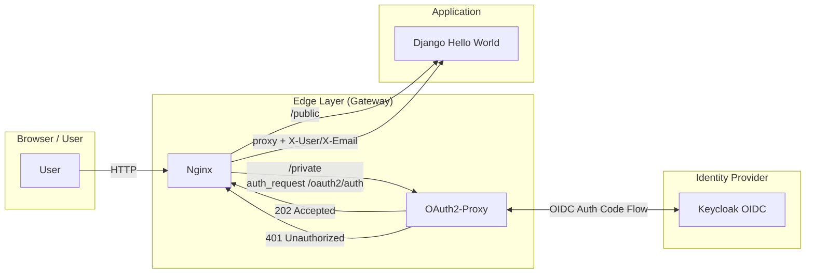
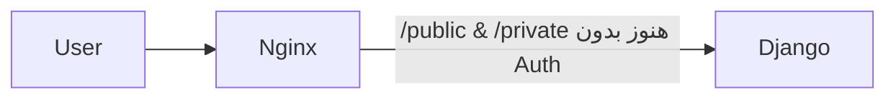
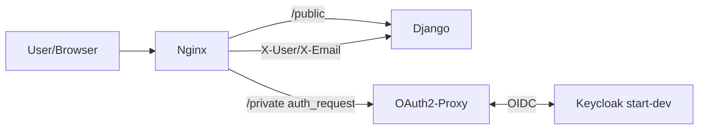
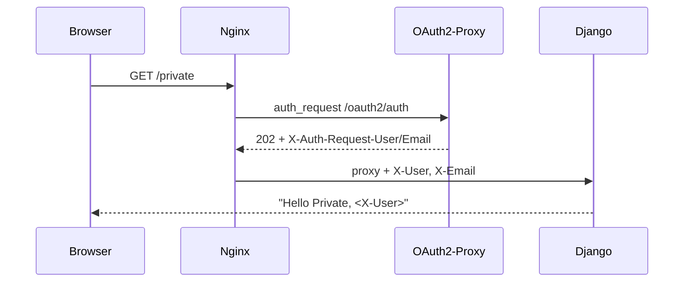

<div dir="rtl">

# Django + Nginx + OAuth2‑Proxy + Keycloak + DockerCompose

> هدف: یک پیج ساده Django بالا بیاوریم که:
>
> * مسیر «عمومی» بدون احراز هویت در دسترس باشد (`/public`)
> * مسیر «خصوصی» فقط با لاگین Keycloak قابل دسترس باشد (`/private`)
> * همه‌چیز ساده، ماژولار و با **Docker Compose** قابل اجرا باشد.

---

## 1) تعریف دقیق پروژه

### شرح کوتاه

یک **Gateway** با Nginx داریم که ترافیک را به سرویس Django می‌برد. برای مسیرهای محافظت‌شده، Nginx از قابلیت `auth_request` استفاده می‌کند تا با **OAuth2‑Proxy** احراز هویت انجام شود. OAuth2‑Proxy هم با **Keycloak** به‌عنوان IdP از طریق **OIDC** صحبت می‌کند. مسیر عمومی نیاز به لاگین ندارد.

### اهداف

* سادگی اجرا: `docker compose up -d` و استفاده از مقداردهی ساده Keycloak.
* جداسازی مسئولیت‌ها (Separation of Concerns): هویت در لبه (edge)، اپلیکیشن ساده.
* قابلیت توسعه: در آینده بتوانیم Role/Group‑based access، Header‑Pass‑Through و … اضافه کنیم.

### کارکردها

* `/public` → پاسخ “Hello Public” از Django، بدون لاگین.
* `/private` → اگر کاربر لاگین نیست → ری‌دایرکت به صفحه ورود Keycloak؛ اگر لاگین است → پاسخ “Hello Private, <user>”.
* عبور هدرهای هویتی به Django (مثل `X-User`, `X-Email`) در مسیر محافظت‌شده.

### نیازمندی‌ها

* Docker, Docker Compose
* پورت‌های لوکال (مثال: `8080` برای Nginx، `8081` برای Keycloak)
* UTF‑8 برای تمام متون فارسی

---

## 2) معماری پیشنهادی (با تحلیل و ارجاع)

### گزینه‌ی انتخاب‌شده (Best Practice برای این سناریو ساده)

**Nginx + `auth_request` → OAuth2‑Proxy → Keycloak**

* Nginx برای مسیرهای محافظت‌شده ابتدا درخواست را به `/oauth2/auth` در OAuth2‑Proxy می‌فرستد؛ اگر `202` بود، ترافیک را به Django عبور می‌دهد؛ اگر `401` بود، کاربر به صفحه‌ی لاگین هدایت می‌شود. این الگو مستند رسمی OAuth2‑Proxy است. ([oauth2-proxy.github.io][1])
* OAuth2‑Proxy با **Keycloak OIDC** کانفیگ می‌شود (issuer, client-id, client-secret, redirect-url). مستند رسمی provider `keycloak-oidc` توضیحات Mapper‌ ها (Audience/Groups/Roles) را نیز آورده است. ([oauth2-proxy.github.io][2])
* Keycloak برای سادگی با `start-dev` بالا می‌آید (Dev mode) و در صورت تمایل، در زمان استارت می‌توانیم Realm را با `--import-realm` ایمپورت کنیم (قرار دادن JSON در `/opt/keycloak/data/import`). ([Keycloak][3])

### دیاگرام معماری کلان



### مزایا / معایب گزینه انتخاب‌شده

**مزایا**

* یکپارچه با Nginx و بدون تغییر کد Django؛ حفاظت حتی برای staticها ممکن است. ([oauth2-proxy.github.io][1], [Reddit][4])
* پیاده‌سازی استاندارد OIDC با Keycloak و کنترل نقش/گروه از طریق Token Claims. ([oauth2-proxy.github.io][2])
* نمونه‌های مرجع ساده و آماده (مثل ریپو deskoh) برای اجرا و دیباگ سریع. ([GitHub][5])

**معایب**

* پیچیدگی اندک در نام دامنه عمومی/داخلی Issuer (به‌خصوص در لوکال). الگوی nip.io و alias شبکه Docker کمک می‌کند که هم مرورگر و هم کانتینرها یک نام دامنه یکسان ببینند. ([GitHub][5])
* مدیریت سشن و کوکی در OAuth2‑Proxy نیازمند توجه به اندازه‌ی token و Split‑Cookie است (راهنمای رسمی اشاره دارد). ([oauth2-proxy.github.io][1])

### گزینه‌های جایگزین (برای آگاهی)

* **OAuth2‑Proxy جلوِ Django (بدون Nginx `auth_request`)**: ساده‌تر برای یک سرویس واحد اما انعطاف کمتری نسبت به توزیع مسیرها دارد. ([oauth2-proxy.github.io][6])
* **ادغام مستقیم Django با OIDC (social-auth, mozilla‑django‑oidc, …)**: کدنویسی در اپ؛ مناسب وقتی Gateway نداریم یا کنترل دقیق درون اپ می‌خواهیم. (خارج از الزام شما چون خواستید Oauth2Proxy+Nginx+Keycloak.)

---

## 3) فازبندی پروژه (High‑Level Plan)

> طبق درخواست شما، در هر فاز ابتدا **دیاگرام فاز** و سپس **دستور ساخت مسیرها/فایل‌ها (ترمینال)** و بعد **جدول فایل‌ها و نقش** و **روش تست** (فقط تعریف کلی) آورده شده است.
> بعد از پایان هر فاز، منتظر تایید شما می‌مانم تا به فاز بعدی برویم.

---
## 3.1) برنامه اجرای فازها (نمای کلی)

1. **فاز 1** — راه‌اندازی اسکلت Compose + Nginx + Django (بدون Auth)
   خروجی: `/public` و `/private` هردو باز.

2. **فاز 2** — افزودن Keycloak (`start-dev --import-realm`) و OAuth2‑Proxy + محافظت `/private` با `auth_request`
   خروجی: `/public` آزاد، `/private` نیازمند لاگین Keycloak.

3. **فاز 3** — عبور هدرهای هویتی به Django و نمایش اطلاعات کاربر در صفحه خصوصی
   خروجی: “Hello Private, <user>”.

4. **فاز 4 (اختیاری)** — Redis session store، TLS، Role/Group‑based access، و سخت‌سازی.


## 3.2) تشریح فازها

### فاز 1 — بوت‌استرپ پایه (Django + Nginx بدون احراز هویت)

#### دیاگرام فاز 1



#### ساخت مسیرها و فایل‌ها (ترمینال)

```bash
mkdir -p auth-stack/{nginx,app}
touch auth-stack/docker-compose.yml
touch auth-stack/nginx/nginx.conf
# اسکلت Django:
mkdir -p auth-stack/app
# (اینجا فقط مسیر می‌سازیم؛ کد را در فاز اجرا اضافه می‌کنیم)
```

#### ساختار TREE این فاز

</div>

```text
auth-stack/
├── docker-compose.yml
├── nginx/
│   └── nginx.conf
└── app/
```
<div dir="rtl">

#### نقش فایل‌ها

| مسیر                 | نقش                                                                          |
| -------------------- | ---------------------------------------------------------------------------- |
| `docker-compose.yml` | تعریف سرویس‌های `nginx` و `django` (فعلاً بدون Keycloak/OAuth2‑Proxy)        |
| `nginx/nginx.conf`   | Reverse proxy ساده به Django؛ تعریف `/public` و `/private` (فعلاً هر دو باز) |
| `app/`               | کد ساده Django (Hello World) برای دو مسیر `/public` و `/private`             |

#### روش تست (کلی)

* اجرای Compose و درخواست به `/public` و `/private` → هر دو پاسخ 200.
* لاگ Nginx/Django بررسی شود؛ هدرهای پایه عبور کنند.

> اگر تایید بفرمایید، در مرحله اجرا کد و کانفیگ مینیمال همین فاز را تولید می‌کنم.

---

### فاز 2 — افزودن Keycloak و OAuth2‑Proxy و محافظت از `/private`

#### دیاگرام فاز 2



#### ساخت مسیرها و فایل‌ها (ترمینال)

```bash
# پوشه‌ها و فایل‌های جدید
mkdir -p auth-stack/{oauth2-proxy,keycloak/realms}
touch auth-stack/oauth2-proxy/oauth2-proxy.cfg
touch auth-stack/keycloak/realms/demo-realm.json
# در صورت تمایل: فایل‌های env مثلاً auth-stack/.env (اختیاری)
```

#### ساختار TREE این فاز

</div>

```text
auth-stack/
├── docker-compose.yml
├── nginx/
│   └── nginx.conf
├── oauth2-proxy/
│   └── oauth2-proxy.cfg
├── keycloak/
│   └── realms/
│       └── demo-realm.json
└── app/
```
<div dir='rtl'>

#### نقش فایل‌ها

| مسیر                              | نقش                                                                                                                                                                                                        |
| --------------------------------- | ---------------------------------------------------------------------------------------------------------------------------------------------------------------------------------------------------------- |
| `keycloak/realms/demo-realm.json` | Realm نمونه برای Import در استارت (نام Realm: `demo`، Client: `oauth2-proxy` با Redirect URI به `http://app.127.0.0.1.nip.io:8080/oauth2/callback`)؛ ایمپورت با `--import-realm`. ([Keycloak][7])          |
| `oauth2-proxy/oauth2-proxy.cfg`   | تنظیمات Provider (`--provider=keycloak-oidc`، `--oidc-issuer-url`، `--client-id/secret`، `--redirect-url`، `--reverse-proxy`، `--set-xauthrequest`، و …). ([oauth2-proxy.github.io][2])                    |
| `nginx/nginx.conf`                | افزودن بلوک‌های `location /oauth2/` و `location = /oauth2/auth` و `auth_request` مطابق راهنمای رسمی. ([oauth2-proxy.github.io][1])                                                                         |
| `docker-compose.yml`              | اضافه‌کردن سرویس‌های `keycloak` (با `start-dev --import-realm`) و `oauth2-proxy` + تعریف network alias برای حل مشکل Issuer دامنه در لوکال (الگوی nip.io، مشابه نمونه deskoh). ([Keycloak][3], [GitHub][5]) |

#### روش تست (کلی)

* درخواست `GET /public` → **200 OK** بدون لاگین.
* درخواست `GET /private` → ری‌دایرکت به صفحه لاگین Keycloak → بعد از ورود، **200 OK** و نمایش نام کاربر (از هدر `X-User`).
* بررسی Set‑Cookie های OAuth2‑Proxy و Validation در `/oauth2/auth` (طبق راهنما). ([oauth2-proxy.github.io][1])

> پس از تایید شما، مرحله اجرا: کانفیگ‌های نمونه‌ی Compose, nginx, oauth2‑proxy و یک realm JSON مینیمال آماده می‌کنم.

---

### فاز 3 — عبور هدرها و نمایش کاربر در Django + تنظیم محدودیت مسیرها

#### دیاگرام فاز 3



#### ساخت مسیرها و فایل‌ها (ترمینال)

```bash
# هیچ مسیر جدیدی لازم نیست؛ فقط آپدیت Django و nginx
```

#### نقش تغییرات

| جزء          | تغییر                                                                                                                     |
| ------------ | ------------------------------------------------------------------------------------------------------------------------- |
| `nginx.conf` | اطمینان از `auth_request_set` و عبور هدرهای `X-User`, `X-Email` به Django. ([oauth2-proxy.github.io][1])                  |
| Django       | ویوی `/private` مقدار هدرها را خوانده و نشان دهد؛ `/public` مثل قبل.                                                      |
| OAuth2‑Proxy | در صورت نیاز `--pass-authorization-header` یا `--pass-access-token` برای سناریوهای پیشرفته. ([oauth2-proxy.github.io][1]) |

#### روش تست (کلی)

* ورود و فراخوانی `/private` → پاسخ شامل نام کاربر از هدر.
* فراخوانی `/public` بدون کوکی → همچنان 200.

> با تایید شما، در مرحله اجرا، ویوی Django هدرها را لاگ/نمایش می‌دهد.

---

### فاز 4 — بهبودها و سخت‌سازی (Optional)

#### موارد پیشنهادی

* **Session Store** در OAuth2‑Proxy (Redis) برای توکن‌های بزرگ OIDC (طبق توصیه‌ی مستند). ([oauth2-proxy.github.io][1])
* **TLS** (Self‑signed برای لوکال یا Let’s Encrypt در واقعی).
* **Role/Group‑based access** با `--allowed-role` و `--allowed-group` در Provider Keycloak OIDC + Mapperهای مناسب در Realm. ([oauth2-proxy.github.io][2])
* **Import Realm پایدار** با JSON و `--import-realm` (Dev) و مهاجرت به DB تولیدی برای Keycloak در محیط‌های واقعی. ([Keycloak][7])
* به‌روز نگه‌داشتن نسخه‌ی OAuth2‑Proxy (به‌خاطر فیکس‌های امنیتی). ([GitHub][8], [ASEC][9])

#### تست‌های کلی

* بررسی مسیرهای خط‌مشی (Route Guards) و ریدایرکت‌های 401/403.
* تست کوکی‌های Split اگر توکن بزرگ است (طبق نکات مستند Nginx). ([oauth2-proxy.github.io][1])

---

## منابع کلیدی (برای یادگیری و تحلیل)

* مستند Integration با **Nginx `auth_request`** در OAuth2‑Proxy (پیکربندی کامل بلوک‌های `/oauth2/` و عبور هدرها). ([oauth2-proxy.github.io][1])
* مستند **Keycloak OIDC Provider** در OAuth2‑Proxy (issuer, audience mapper, roles/groups). ([oauth2-proxy.github.io][2])
* **Keycloak Docker Getting Started** (`start-dev`) و ایمپورت Realm با `--import-realm` و مسیر `/opt/keycloak/data/import`. ([Keycloak][3])
* ریپوی آموزشی **deskoh** (الگوی nip.io و alias شبکه برای سازگاری نام‌دامنه بین مرورگر و کانتینرها). ([GitHub][5])
* یادداشت‌های تکمیلی درباره الگوی LB با nginx + oauth2‑proxy + keycloak (نوشته‌ی وبلاگی). ([layandreas.github.io][10])

---

### آماده برای ادامه؟

اگر این طراحی و فازبندی را تایید می‌کنی، با «فاز 1» شروع کنم تا اسکلت **Compose + Nginx + Django** (بدون Auth) را بسازم و تحویل بدهم؟

[1]: https://oauth2-proxy.github.io/oauth2-proxy/configuration/integration/ "Integration | OAuth2 Proxy"
[2]: https://oauth2-proxy.github.io/oauth2-proxy/configuration/providers/keycloak_oidc/ "Keycloak OIDC | OAuth2 Proxy"
[3]: https://www.keycloak.org/getting-started/getting-started-docker "Docker - Keycloak"
[4]: https://www.reddit.com/r/selfhosted/comments/trf8h3/nginx_auth_request_and_keycloak/?utm_source=chatgpt.com "Nginx auth_request and Keycloak? : r/selfhosted"
[5]: https://github.com/deskoh/nginx-oauth2-proxy-demo "GitHub - deskoh/nginx-oauth2-proxy-demo: NGINX with OAuth2 Proxy and Keycloak demo"
[6]: https://oauth2-proxy.github.io/oauth2-proxy/configuration/overview/?utm_source=chatgpt.com "Overview | OAuth2 Proxy - GitHub Pages"
[7]: https://www.keycloak.org/server/importExport?utm_source=chatgpt.com "Importing and exporting realms - Keycloak"
[8]: https://github.com/oauth2-proxy/oauth2-proxy/releases?utm_source=chatgpt.com "Releases · oauth2-proxy/oauth2-proxy"
[9]: https://asec.ahnlab.com/en/89392/?utm_source=chatgpt.com "OAuth2-Proxy Security Update Advisory (CVE-2025-54576)"
[10]: https://layandreas.github.io/personal-blog/posts/securing_any_app_with_oauth2_proxy/?utm_source=chatgpt.com "Securing any App with Oauth2Proxy | Personal Blog"
