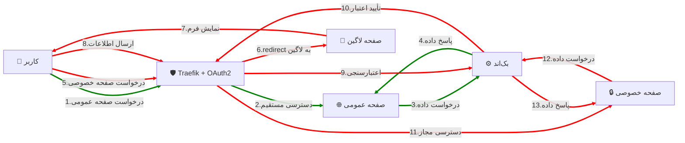

```mermaid
flowchart LR
    User[👤 کاربر]
    Traefik[🛡️ Traefik + OAuth2]
    Backend[⚙️ بک‌اند]
    
    PublicPage[🌐 صفحه عمومی]
    PrivatePage[🔒 صفحه خصوصی]
    Login[🔑 صفحه لاگین]

    %% مسیرهای عمومی - بدون احراز هویت
    User -- 1.درخواست صفحه عمومی --> Traefik
    Traefik -- 2.دسترسی مستقیم --> PublicPage
    PublicPage -- 3.درخواست داده --> Backend
    Backend -- 4.پاسخ داده --> PublicPage

    %% مسیرهای خصوصی - نیازمند احراز هویت
    User -- 5.درخواست صفحه خصوصی --> Traefik
    Traefik -- 6.redirect به لاگین --> Login
    Login -- 7.نمایش فرم --> User
    User -- 8.ارسال اطلاعات --> Traefik
    Traefik -- 9.اعتبارسنجی --> Backend
    Backend -- 10.تأیید اعتبار --> Traefik
    Traefik -- 11.دسترسی مجاز --> PrivatePage
    PrivatePage -- 12.درخواست داده --> Backend
    Backend -- 13.پاسخ داده --> PrivatePage

    %% استایل خطوط
    linkStyle 0,1,2,3 stroke:green,stroke-width:3px
    linkStyle 4,5,6,7,8,9,10,11,12 stroke:red,stroke-width:3px
```